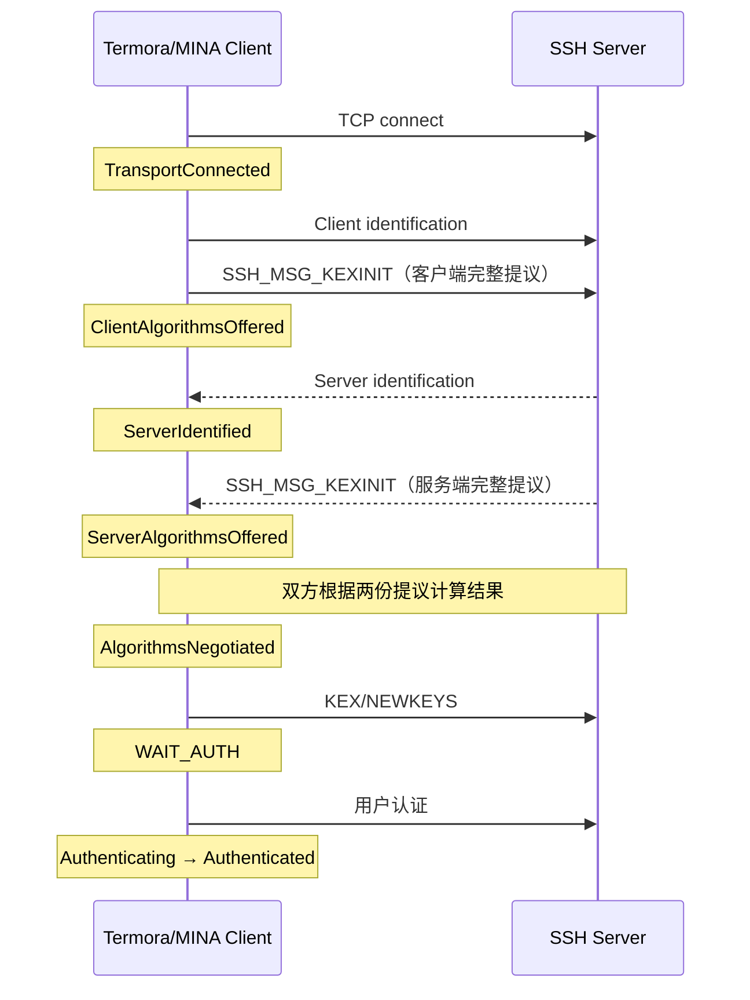

# SSH 算法策略与连接诊断

> 适用版本：Termora 2.x  
> 实现基线：`b6b908f feat(ssh): 增加算法策略与连接诊断`、`4de1eab fix(ssh): 非 Debug 模式输出具体失败原因`

## 1. 背景与目标

本功能解决以下问题：

1. SSH 建立连接时不再只显示笼统的进度，而是按连接阶段输出状态。
2. 在“设置 → 常规”提供统一的 Debug 开关；开启后显示完整 SSH 握手诊断，同时继续控制终端调试输出。
3. 主机 SSH 设置可以配置版本、密钥交换、主机密钥、加密、MAC 和压缩策略。
4. 算法不再只有“启用并排序”一种状态，而是分为正常、需要警告、禁用三段。
5. Apache MINA SSHD 升级后新增或移除算法时，已有用户策略不会被静默破坏。
6. 即使未开启 Debug，连接失败时也必须保留足够判断原因的信息。

设计原则：

- 未启用自定义时，完全委托当前 MINA 默认策略，不复制一份可能过时的默认列表。
- 自定义列表的顺序就是实际提议优先级，不使用字母排序，也不显示额外的 `#序号`。
- 不把协议中不存在的“中间列表”包装成日志；只显示双方原始提议和最终结果。
- 需要确认的弱算法必须在发送密码、私钥认证数据之前获得用户许可。
- 普通模式提供简洁但可定位问题的失败原因；完整候选列表只在 Debug 模式显示。

---

## 2. 设置入口

### 2.1 Debug 开关

入口：**设置 → 常规 → Debug**。

底层继续使用 `database.terminal.debug`，因此这是一个统一开关：

- SSH 连接页显示详细握手日志；
- 已打开终端同步更新 `TerminalPanel.Debug`；
- 关闭后不再显示完整算法提议，避免普通连接产生大量输出。

### 2.2 主机 SSH 设置

SSH 设置包含一个版本选择和五类算法列表：

| 配置 | 可选内容 |
|---|---|
| SSH 版本 | 自动、强制 SSH-1、强制 SSH-2 |
| 密钥交换 | KEX 算法优先级与状态 |
| 主机密钥 | 服务端主机密钥/签名算法优先级与状态 |
| 加密 | Cipher 优先级与状态 |
| MAC | MAC 优先级与状态 |
| 压缩 | Compression 优先级与状态 |

Apache MINA SSHD 仅支持 SSH-2。界面保留“强制 SSH-1”用于明确表达配置意图，但保存校验和客户端创建都会拒绝该选项；“自动”和“强制 SSH-2”当前都使用 SSH-2。

---

## 3. 自定义算法策略

### 3.1 自定义开关

每个主机只有一个“自定义 SSH 算法”开关，统一控制五类算法：

- **关闭**：不向 `ClientBuilder` 设置算法工厂，直接使用当前 MINA 默认策略及其真实优先级。
- **开启**：五类算法均使用保存的三段策略；保存前要求每一类至少有一个当前 MINA 可用的已启用算法。

关闭开关不会删除已经保存的策略。用户再次开启时，原有顺序和状态仍然存在。

### 3.2 三段列表

每个算法列表固定包含两个标记：

```text
正常启用算法
== warn below ==
启用但需要确认的算法
== disabled below ==
禁用算法
```

语义如下：

| 区域 | 是否发送给服务端 | 是否可被协商 | 额外行为 |
|---|---:|---:|---|
| `warn` 上方 | 是 | 是 | 无 |
| `warn` 与 `disabled` 之间 | 是 | 是 | 命中后认证前弹出警告 |
| `disabled` 下方 | 否 | 否 | 不加入 MINA 工厂列表 |

算法和标记都可以上下移动。实现禁止 `warn` 与 `disabled` 两个标记互相跨越，因而始终满足：

```text
warn 在 disabled 上方
```

算法跨越标记时，其状态随所在区域改变。实际发送顺序为 `normal + warn`，禁用区不参与握手。

### 3.3 推荐策略

“恢复推荐策略”在运行时根据当前 MINA 构造，不维护静态字母列表：

1. 当前 MINA 默认算法按原始优先级放入 `normal`；
2. Termora 旧代码额外开启的兼容算法放入 `warn`；
3. 其余当前可用算法放入 `disabled`。

主要兼容项包括：

- KEX：旧代码额外加入的 `diffie-hellman-group1-sha1`、`diffie-hellman-group14-sha1`、`diffie-hellman-group-exchange-sha1`（仅在当前运行环境支持时出现）；
- 主机密钥：当前 MINA 支持但不属于默认集合的签名类型；
- 压缩：`zlib` 和 `zlib@openssh.com`；
- Cipher、MAC：不额外扩大当前 MINA 默认集合。

`none` Cipher 不进入用户候选列表。`diffie-hellman-group1-sha1` 的 MINA fallback 也只在用户自定义策略确实启用该算法时打开。

---

## 4. 配置存储与迁移

配置保存在 `Host.options.extras`。

| 键 | 含义 |
|---|---|
| `sshVersion` | `Auto`、`V1` 或 `V2` |
| `sshAlgorithmsCustomized` | 是否启用自定义算法 |
| `sshKeyExchangePolicy` | KEX 三段策略 JSON |
| `sshHostKeyPolicy` | 主机密钥三段策略 JSON |
| `sshCipherPolicy` | Cipher 三段策略 JSON |
| `sshMacPolicy` | MAC 三段策略 JSON |
| `sshCompressionPolicy` | Compression 三段策略 JSON |

策略结构：

```json
{
  "version": 1,
  "normal": ["algorithm-a"],
  "warn": ["algorithm-b"],
  "disabled": ["algorithm-c"]
}
```

### 4.1 旧排序配置

旧版本使用以下逗号分隔键保存排序：

- `sshKeyExchangeAlgorithms`
- `sshHostKeyAlgorithms`
- `sshCipherAlgorithms`
- `sshMacAlgorithms`
- `sshCompressionAlgorithms`

若旧顺序体现了用户自定义，会迁移为 `normal`，未列出的当前算法进入 `disabled`。如果旧值等价于当时的有效默认策略，则不强制开启自定义，而是继续跟随当前 MINA 默认。

### 4.2 MINA 升级兼容

策略规范化遵守以下规则：

- 重复算法只保留第一次出现的位置；
- 已保存但当前 MINA 不再提供的算法仍保留在原区域，界面灰显并标注“当前 MINA 版本不可用”；
- MINA 新增且用户从未配置过的算法追加到 `disabled`，不会被自动启用；
- 构造实际工厂列表时，只采用当前可用的 `normal + warn`；
- 至少需要一个当前可用的已启用算法，否则阻止保存。

这样既不会因升级丢失用户意图，也不会在升级后静默扩大安全面。

---

## 5. 弱算法警告

完成初始算法协商后，Termora 检查最终结果是否命中任一 `warn` 区算法。Cipher、MAC、Compression 同时检查 C2S 和 S2C，并对相同结果去重。

若命中：

1. 暂不添加密码或私钥身份；
2. 弹出汇总警告框，列出类别和算法；
3. 用户可选择“仅本次继续”或“取消连接”；
4. 只有确认后才添加认证身份并调用 `session.auth()`。

因此警告发生在认证数据发送之前。无法取得窗口 owner 时采用安全失败策略，直接取消连接。

该确认只对本次连接有效，不会修改保存的算法策略。

---

## 6. 连接事件与日志时序

连接进度由 `SshClients.ConnectionProgress` 驱动，初始握手监听 MINA `SessionListener` 事件。



客户端 `KEXINIT` 在自定义 `ClientSession.sendKexInit()` 的最终写包入口捕获，包含真正准备发送的完整 Map，而不是尚可能被 MINA 修改的草稿。

服务端完整提议在 `sessionNegotiationStart` 收到，最终结果在 `sessionNegotiationEnd` 成功时记录。算法信息的逻辑顺序始终是：

```text
客户端整包 → 服务端整包 → 协商结果
```

服务端版本属于独立事件，可能按真实到达时间出现在客户端整包和服务端整包之间。

协议对 Cipher、MAC、Compression 分别提供 C2S/S2C 字段。日志中两个方向相同时合并为一行，确实不同时才分别显示，避免制造重复噪音。

### 6.1 Debug 关闭

普通模式显示连接阶段，但隐藏双方完整算法列表和完整协商结果。

若 KEX 失败，具体 MINA 原因不受 Debug 开关限制，例如：

```text
[SSH] 密钥交换失败原因：SshException: Unable to negotiate key exchange for encryption algorithms (client: 3des-cbc / server: ...)
```

同一异常会以 WARN 写入应用日志并保留堆栈。其他连接、认证、通道异常继续由 `PtyHostTerminalTab` 的统一异常处理输出根本原因。

### 6.2 Debug 开启

额外显示：

- 客户端发送的完整 KEX 提议；
- 服务端发送的完整 KEX 提议；
- 最终协商结果；
- 认证方式：`password`、`publickey`、`publickey (ssh-agent)`、`keyboard-interactive` 或 `none`；
- 更细的准备客户端、打开通道、端口转发等阶段。

这里输出的是当前配置的认证方式，不是服务端支持的认证方法列表。日志不得输出密码、私钥内容或 Agent 凭据。

### 6.3 失败去重

MINA 事件回调会第一时间报告提议和失败；`waitFor(WAIT_AUTH/CLOSED)` 之后的兜底逻辑只补充尚未报告的数据。

每个连接监听器使用原子状态记录：

- 客户端提议是否已报告；
- 服务端提议是否已报告；
- KEX 失败是否已报告。

因此实时事件和关闭后的兜底不会重复打印完整算法列表或失败原因。

---

## 7. 关键实现文件

| 文件 | 职责 |
|---|---|
| `SettingsOptionsPane.kt` | 将统一 Debug 开关放到“设置 → 常规” |
| `SSHHostOptionsPane.kt` | SSH 版本、自定义开关、三段列表、排序和保存校验 |
| `SshAlgorithms.kt` | MINA 目录、默认策略、迁移、规范化、工厂顺序和 warn 检测 |
| `SshAlgorithmWarningDialog.kt` | 认证前弱算法确认 |
| `SshClients.kt` | 应用算法工厂、事件监听、握手失败捕获、认证前确认 |
| `SSHTerminalTab.kt` | 连接阶段、算法整包、认证方式和失败原因的终端输出 |

---

## 8. 验证与回归

相关测试：

| 测试 | 覆盖内容 |
|---|---|
| `SshAlgorithmsTest` | 推荐策略、旧配置迁移、新增/消失算法、启用顺序、warn 去重 |
| `SshConnectionStatusTest` | 空服务端版本、认证方式、C2S/S2C 合并、根因格式化 |
| `I18nTest` | 六套语言资源键一致 |
| `SFTPTest` | Testcontainers 真实 SSH/SFTP 成功链路、事件顺序、3DES 不兼容失败及去重 |

常用验证命令：

```powershell
.\gradlew.bat :compileKotlin :compileTestKotlin
.\gradlew.bat :test --tests app.termora.plugin.internal.ssh.SshAlgorithmsTest --tests app.termora.plugin.internal.ssh.SshConnectionStatusTest --tests app.termora.I18nTest
.\gradlew.bat :test --tests app.termora.SFTPTest
git diff --check
```

---

## 9. 维护约束与已知限制

1. MINA 升级后应重新检查 `ClientBuilder.setUpDefault*` 的顺序，以及 `Builtin*` 中 `isSupported` 的变化。
2. 新算法必须默认进入 `disabled`；不得因为依赖升级自动启用。
3. 消失算法必须保留在保存区域并灰显；不得加载配置时直接删除。
4. `warn` 必须始终位于 `disabled` 上方。
5. 完整提议必须按单个 `KEXINIT` 整包打印，不得伪装成各类别逐项往返。
6. 非 Debug 模式不得输出冗长完整列表，但 KEX 失败必须输出具体不兼容原因。
7. 当前事件诊断和 warn 确认针对初始 KEX；会话建立后的 rekey 尚未纳入本功能。
8. 同一个 `SshClient` 的算法策略会作用于通过它建立的各跳会话，包括跳板机链路。
9. SSH-1 仍不受 Apache MINA SSHD 支持；不得把界面选项误认为引擎能力。
