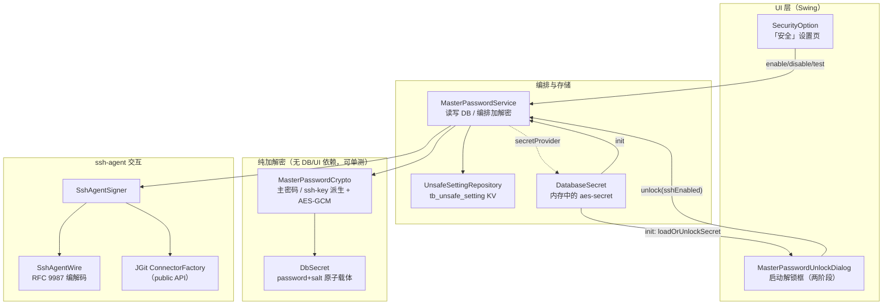
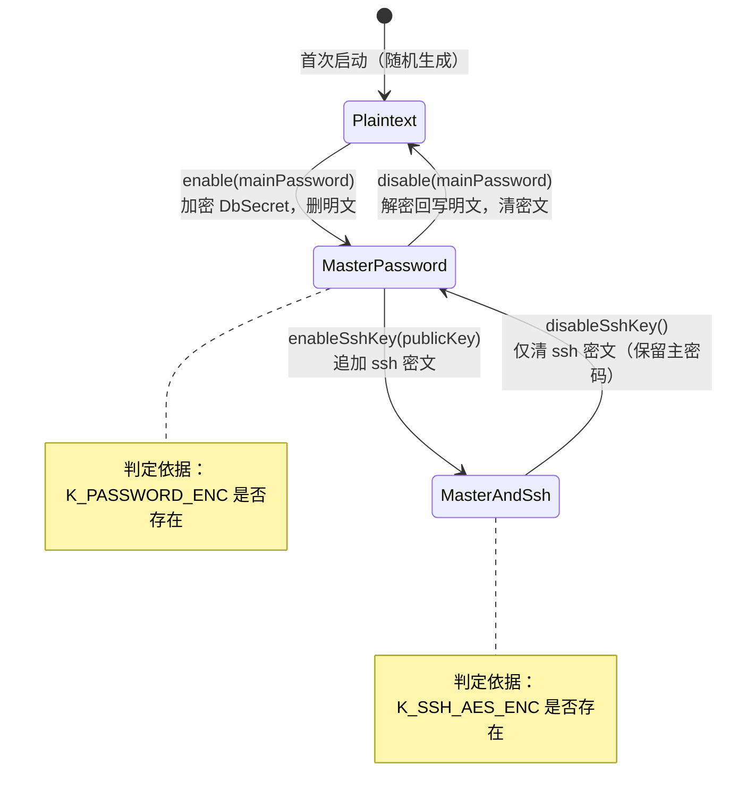
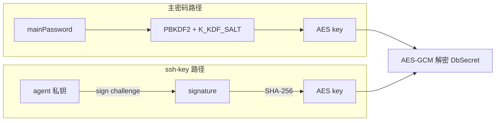
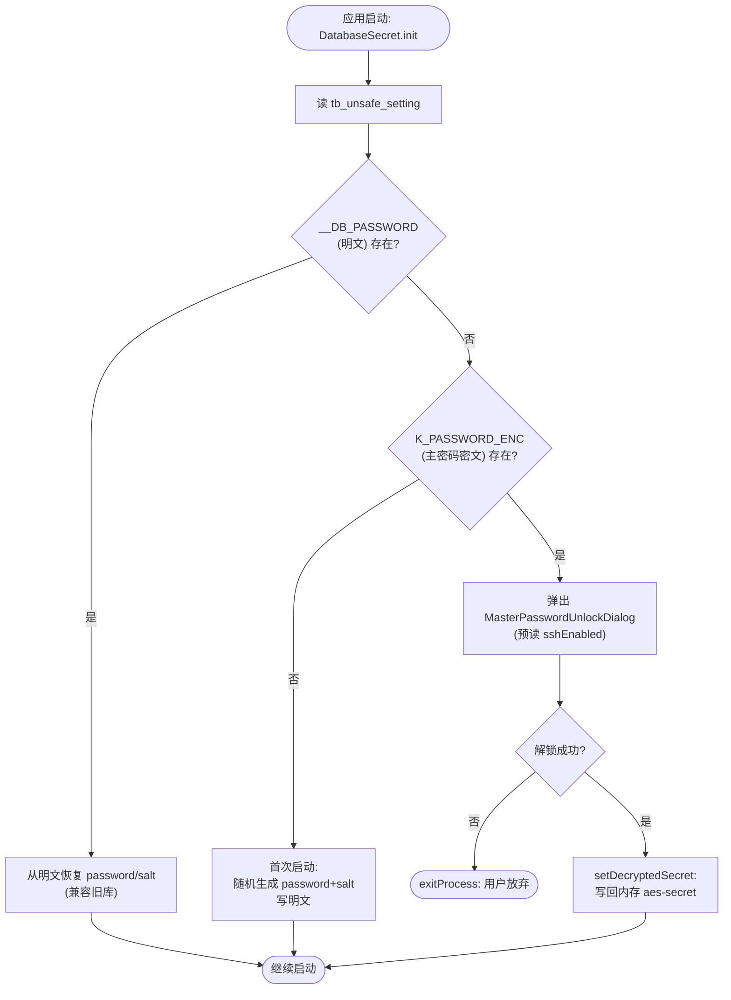
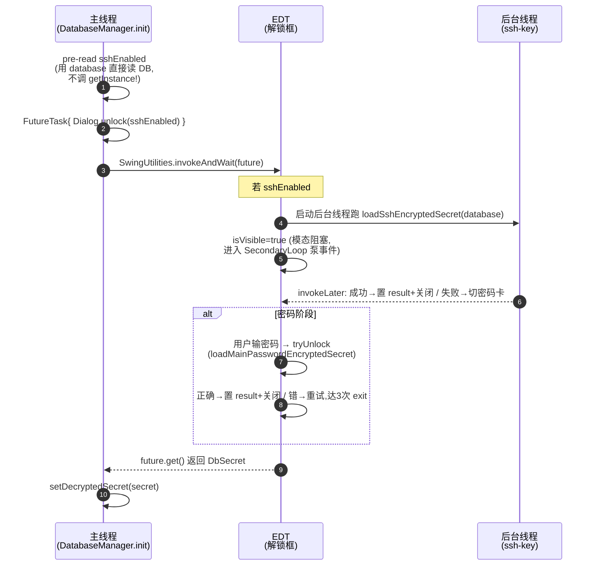
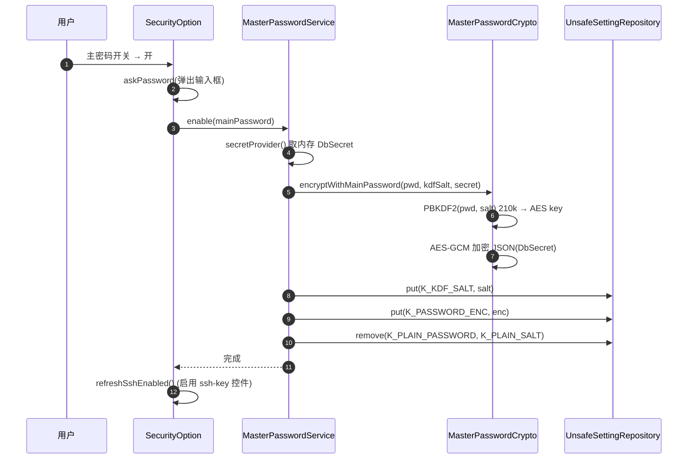
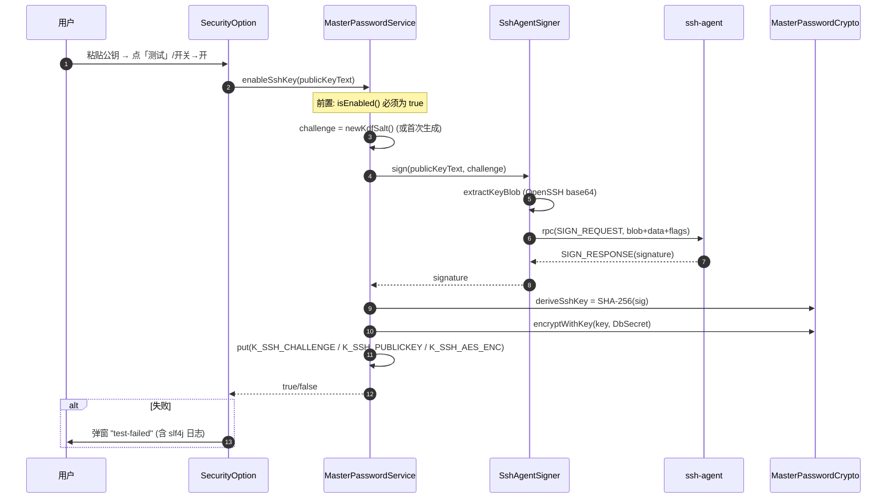
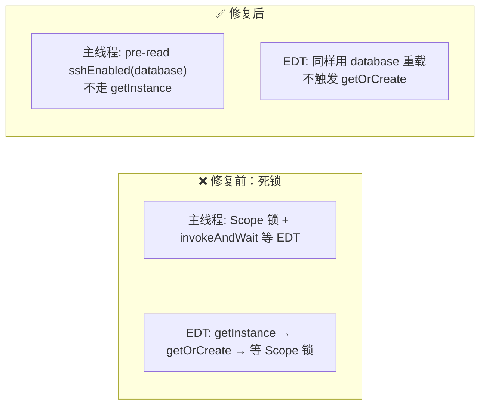

# 主密码（Master Password）机制设计文档

> 分支：`feature/master-password`（单 commit `75dec96`，基线 `5ff2882`）
> 适用版本：termora 2.x

## 1. 背景与目标

termora 的本地数据库（`database.termora`，SQLite）中，所有敏感数据（主机密码、密钥、连接配置等）都由一个 **`aes-secret`** 加密。`aes-secret` 本身由 `DatabaseSecret` 在首次启动时随机生成，原本以**明文**形式存放在 `tb_unsafe_setting` 表（`__DB_PASSWORD` / `__DB_SALT`）。

也就是说：拿到数据库文件 ≈ 拿到 `aes-secret` ≈ 解密全部敏感数据。明文存储的 `aes-secret` 是整个加密体系的单点明文。

本特性的目标是给 `aes-secret` 再加一层**口令/凭据保护**：启动时必须先解锁，才能把 `aes-secret` 还原到内存供业务使用。提供两种**互不冲突**的解锁方式：

| 解锁方式 | 凭据 | 适用场景 |
|---|---|---|
| **主密码**（main-password） | 用户自己记住的口令 | 通用，任何时候都能用 |
| **ssh-key**（签名派生） | 本地 ssh-agent 中持有的私钥 | 免输入，agent 在场即可解锁 |

设计原则：
- **两种方式各自独立加密 `aes-secret`**，互不复用、互不依赖（除了 ssh-key 要求主密码已启用，仅作为配置前提）。
- **不引入任何新依赖**：加密复用既有 `Crypto.kt`，ssh-agent 通信复用 JGit 的 `ConnectorFactory`。
- **私钥永不离开 ssh-agent**：ssh-key 路径只让 agent 对一个固定 challenge **签名**，用签名派生密钥，而非导出私钥。

---

## 2. 架构总览



层次划分：
- **UI 层**只做交互转译，不持有密文/口令状态。
- **编排层** `MasterPasswordService` 负责「在内存 `DbSecret` 与 DB 密文之间转换」，是唯一组合 DB + 加密 + agent 的地方。
- **纯加解密层** `MasterPasswordCrypto` 无 DB/UI 依赖，完全可单测（已有 `MasterPasswordCryptoTest`）。
- **agent 层**自实现 ssh-agent 协议，仅依赖 JGit public 包。

---

## 3. 数据模型与存储

### 3.1 DbSecret：aes-secret 的原子载体

```kotlin
@Serializable
data class DbSecret(val password: String, val salt: String)
```

**关键决策：`password` 与 `salt` 必须整体加解密。** `aes-secret` 由这两部分共同决定（加密用的派生密钥同时依赖二者）。若只加密 `password` 而 `salt` 仍明文，攻击者篡改 `salt` 会让还原出的 `aes-secret` 错位，导致**整个数据库彻底无法解密**且无后门。把二者打包成一个 `DbSecret` 原子加密，要么整体正确还原，要么整体失败（GCM 校验不过），杜绝「salt 被悄悄改坏」的半损坏态。

序列化用项目既有的 `Application.ohMyJson`（`kotlinx.serialization`）。

### 3.2 存储表：tb_unsafe_setting

`UnsafeSettingRepository` 是对明文表 `tb_unsafe_setting` 的轻量 KV 访问（`name` → `value`，均为字符串）。该表由 `DatabaseManager.init` 在建库时 `SchemaUtils.create(UnsafeSettingEntity)` 先行创建，保证读取顺序安全。

实现要点：
- `put` 为 **upsert**（先 `deleteWhere` 同名再 `insert`），避免主键冲突。
- 每次操作各自开 `transaction(database)`，**调用方不需要、也不应该再外包事务**（见 §7 死锁规避）。

### 3.3 存储键清单（`MasterPasswordService` 常量）

| 常量 | 值 | 含义 | 存在时机 |
|---|---|---|---|
| `K_PLAIN_PASSWORD` | `__DB_PASSWORD` | 明文 aes-password | 首次启动 / 旧库 / 关闭主密码后 |
| `K_PLAIN_SALT` | `__DB_SALT` | 明文 aes-salt | 同上 |
| `K_KDF_SALT` | `__DB_KDF_SALT` | 主密码 PBKDF2 salt | 启用主密码后 |
| `K_PASSWORD_ENC` | `__DB_PASSWORD_ENC` | 主密码加密的 DbSecret 密文 | 启用主密码后 |
| `K_SSH_AES_ENC` | `__DB_SSH_AES_ENC` | ssh-key 加密的 DbSecret 密文 | 启用 ssh-key 后 |
| `K_SSH_PUBLICKEY` | `__DB_SSH_PUBLICKEY` | 录入的 OpenSSH 公钥文本 | 启用 ssh-key 后 |
| `K_SSH_CHALLENGE` | `__DB_SSH_CHALLENGE` | 固定 challenge（base64） | 启用 ssh-key 后 |

`DatabaseSecret.kt` 内部 `PASSWORD`/`SALT` 与 `K_PLAIN_PASSWORD`/`K_PLAIN_SALT` **同值**（两侧读同一张表），用注释标注保持同步。

### 3.4 状态机



**状态判定不靠布尔标志位，靠「密文是否存在」**——这是唯一可信事实源（truth from disk）。`isEnabled()` ⟺ `K_PASSWORD_ENC != null`；`isSshKeyEnabled()` ⟺ `K_SSH_AES_ENC != null`。

---

## 4. 加密细节与技术选型

### 4.1 主密码路径

| 环节 | 选型 | 参数 | 出处 |
|---|---|---|---|
| 口令派生 | `PBKDF2WithHmacSHA512` | 迭代 `210_000` 次，输出 `256-bit` | `Crypto.kt: PBKDF2` + `MasterPasswordCrypto.PBKDF2_ITERATIONS` |
| KDF salt | 随机 16 字节 | 每次启用主密码新生成，存 `K_KDF_SALT` | `newKdfSalt()` |
| 对称加密 | AES-256 **GCM**（认证加密） | tag `128-bit`，IV `12 字节` | `Crypto.kt: AES.GCM` |
| 随机源 | `RandomUtils.secureStrong()` | `SecureRandom.getInstanceStrong()` | `Crypto.kt: AES.randomBytes` |
| 密文封装 | `base64( iv[12] ‖ GCM-ciphertext )` | — | `encryptWithKey` |

- **210 000 次迭代**：参考 OWASP 当前对 PBKDF2-SHA512 的推荐下限，兼顾离线爆破阻力与启动延迟（现代 CPU 上约几十毫秒）。
- **GCM 自带完整性校验**：主密码错误时 `doFinal` 抛 `AEADBadTagException`，`decryptWithKey` 用 `runCatching{}.getOrNull()` 吞掉并返回 `null`，从而把「密码错」归一化为 `null` 返回值，无需单独的错误通道。

### 4.2 ssh-key 路径（签名派生）

```
challenge(固定，存 DB) ──agent.sign(publicKey, challenge)──▶ signature
                                                                 │
                                                                 ▼
                                                          SHA-256(signature)
                                                                 │
                                                                 ▼
                                                      AES-256 key ──▶ 解密 K_SSH_AES_ENC
```

| 环节 | 选型 | 说明 |
|---|---|---|
| 密钥派生 | `SHA-256(signature)` | 签名的哈希即 AES key，确定性 |
| 对称加密 | 同主密码（AES-256-GCM，IV 12B） | 复用 `encryptWithKey` |
| challenge | `newKdfSalt()` = base64(16 随机字节) | 启用时生成一次，固化在 `K_SSH_CHALLENGE` |

**为什么用「签名派生」而非「公钥加密 / 私钥解密」**：ssh-agent 协议只暴露 `REQUEST_IDENTITIES`（列公钥）和 `SIGN_REQUEST`（请求签名）两类能力，**永远不会导出私钥**。因此只能用「让 agent 签名 → 从签名派生密钥」的非对称路径。challenge 固定不变，所以同一把 agent 私钥每次对同一 challenge 签名得到同一签名（见 §5.3 确定性），从而派生出同一 AES key，解锁成功。

> 注：本路径**直接加密 `aes-secret` 本身**，不再经过主密码。两者是平行的两条加密链。

### 4.3 两条路径的对称性与差异



两条链只在「派生 AES key」这一步不同，之后完全复用 `decryptWithKey` / `encryptWithKey`，逻辑收敛。

---

## 5. ssh-agent 交互细节

### 5.1 为什么自实现而非用现成库

termora 已经依赖 JGit（用于 git 集成），JGit 内置了 ssh-agent 连接器 `org.eclipse.jgit.transport.sshd.agent.ConnectorFactory`（跨平台：Windows 用 named pipe / Pageant，Unix 用 AF_UNIX socket）。复用它即可拿到「与本地 agent 通信」的能力，**不需要新依赖、也不需要 native 代码**。

但 JGit 的 `Connector` 是底层字节通道，不直接提供「列公钥 / 签名」的语义方法。因此我们自实现 ssh-agent 协议（RFC 9987）的 payload 编解码（`SshAgentWire`），再通过 JGit 的 `Connector.rpc()` 收发。

### 5.2 协议消息（RFC 9987）

| 消息类型 | 值 | 方向 | 用途 |
|---|---|---|---|
| `SSH_AGENTC_REQUEST_IDENTITIES` | 11 | client→agent | 请求公钥列表 |
| `SSH_AGENT_IDENTITIES_ANSWER` | 12 | agent→client | 返回公钥列表 |
| `SSH_AGENTC_SIGN_REQUEST` | 13 | client→agent | 请求用某 key 签名 |
| `SSH_AGENT_SIGN_RESPONSE` | 14 | agent→client | 返回签名 |
| `SSH_AGENT_RSA_SHA2_256` | `0x02` | sign flag | RSA 强制用 SHA-256（避免 SHA-1） |

`SshAgentWire` 编解码 payload（首字节为 message type，后接 SSH wire 字段：`uint32`=4B 大端，`string`=uint32 长度+字节）。**length frame（uint32 总长前缀）由 JGit Connector 处理，本层不负责**。

### 5.3 关键实现点

**(a) `Connector.rpc` 契约**（来自 JGit `AbstractConnector.prepareMessage`）：
- 入参 `body = [4-byte length 占位][payload bytes]`，payload **不含** command byte；
- command byte 作为 `rpc` 第一参数单独传，`prepareMessage` 会把 `body[4]` 覆写为它；
- 返回值 = response payload（**不含** length 前缀，**含** response command byte）。

为此 `SshAgentSigner.frame()` 把 `SshAgentWire` 产出的 payload（首字节即 command byte）包装成 `[4B length 占位][payload]`，并单独取出 command byte：

```kotlin
private fun frame(payload: ByteArray): RpcFrame {
    val command = payload[0]
    val body = ByteArray(4 + payload.size)
    BufferUtils.putUInt(payload.size.toLong(), body, 0, 4)  // 占位，prepareMessage 会覆写
    System.arraycopy(payload, 0, body, 4, payload.size)
    return RpcFrame(command, body)
}
```

**(b) key blob 必须直接取自 OpenSSH 文本 base64**（曾踩坑）：

```kotlin
// ✅ 正确：直接 base64 decode OpenSSH 文本第二段 = agent 内部存储的 blob
val keyBlob = extractKeyBlob(publicKeyText)   // "ssh-ed25519 AAAA... comment" → decode(parts[1])

// ❌ 错误（曾导致 "no such key"）：
//    putPublicKey(parsePublicKey(text)) 往返重建 blob，
//    对部分 key 类型可能产生与 agent 存储不一致的字节，agent 按 blob 查不到匹配 → 拒签。
```

agent 按 key blob 精确匹配私钥，因此 SIGN_REQUEST 里的 blob 必须与 agent 内部存储**逐字节相同**——直接用 OpenSSH 公钥文本的 base64 解码即可保证。

**(c) RSA 强制 SHA-256**：
```kotlin
private fun flagsFor(algo: String): Byte = when (algo) {
    "ssh-rsa" -> SshAgentWire.SSH_AGENT_RSA_SHA2_256  // 0x02，避免 SHA-1
    else -> 0                                          // ed25519 / ecdsa 无需 flag
}
```

**(d) 确定性**：challenge 固定存于 DB，私钥固定于 agent，签名算法固定（ed25519 与 RSA-PKCS#1v1.5-SHA256 均为确定性签名），故 `signature` 确定性 ⇒ 派生 AES key 确定性 ⇒ 每次启动都能解出同一 `DbSecret`。这是 ssh-key 免密解锁成立的数学前提。

**(e) 错误不再被吞**（曾踩坑）：agent 拒签时，`SshAgentSigner.sign` 抛带诊断信息的 `IOException`（含 response 码与 blob），且 `MasterPasswordService` 的所有 `catch` 都 `log.warn(e)`。

---

## 6. 关键流程

### 6.1 启动解锁总流程（`DatabaseSecret.loadOrUnlockSecret`）



四个分支：① 明文兼容（旧库）；② 主密码启用 → 弹框解锁；③ 首次启动 → 随机生成；④（隐含）解锁失败 → 退出进程，绝不带空 secret 继续启动。

### 6.2 启动解锁线程时序（含死锁规避）



**EDT 安全要点**：`isVisible=true` 模态阻塞必须在 EDT 执行（否则 Linux/macOS 上 NPE 或卡死）。用 `FutureTask` + `invokeAndWait` 把整个解锁放到 EDT；模态时 EDT 进入 `SecondaryLoop` 泵送事件，按钮回调得以派发，不死锁。本路径由**主线程**进入，故 `invokeAndWait` 不会抛 `IllegalStateException`。

### 6.3 启用主密码（设置页）



### 6.4 启用 ssh-key（设置页 / 测试按钮）



---

## 7. 启动时序与死锁规避（重要）

本特性踩过的两个坑都已修复，记录于此供后续维护参考。

### 7.1 启动死锁

**现象**：开启主密码后重启，解锁框不弹出，应用卡死。

**根因**：`ApplicationScope.getOrCreate` 在 `synchronized(this)` **内部**调用 `create.invoke()`：

```
DatabaseManager.init ── 主线程持有 Scope 锁
   └─ DatabaseSecret.init → loadOrUnlockSecret
        └─ invokeAndWait(等 EDT)
              EDT: Dialog.unlock → MasterPasswordService.isSshKeyEnabled()
                   └─ repoProvider → DatabaseManager.getInstance()
                        └─ getOrCreate → synchronized(Scope)  ← 阻塞等主线程放锁
   主线程又在等 EDT → 死锁
```

若在主线程自身递归进入 `getOrCreate`，则 `create` 再次 `init` → 无限递归 / `StackOverflow`。

**修复（双管齐下）**：
1. **解锁流程用 `database` 参数绕开 `getInstance`**：`MasterPasswordService` 新增 `isSshKeyEnabled(database)` / `loadSshEncryptedSecret(database)` / `loadMainPasswordEncryptedSecret(database, pwd)` 等重载，直接用调用方传入的 `Database` 构造 `UnsafeSettingRepository(database)`，绝不走 `DatabaseManager.getInstance()`。
2. **去掉 `DatabaseSecret.getInstance` 外层 `transaction{}` 包裹**（`DatabaseManager.kt`）：`DatabaseSecret.init` 内部已自行开事务读 DB；若主线程在此持有 SQLite 事务锁，EDT 的 DB 读会等该锁，而主线程又在 `invokeAndWait` 等 EDT → 另一种死锁。



### 7.2 ssh-key 签名失败被静默吞没

**现象**：ssh-key 测试报 "agent refused to sign"，但既无日志也无 UI 提示（异常被 `catch` 吞掉）。

**根因**：① key blob 经 `putPublicKey(parsePublicKey(text))` 往返后与 agent 存储不一致 → agent 找不到 key → 返回 FAILURE；② `catch` 块只 `return false/null`，没有日志。

**修复**：① blob 直接 `extractKeyBlob`（OpenSSH base64 解码）；② 所有 `catch` 加 `log.warn(e)`，拒签错误信息附带 response 码与 blob，便于继续诊断。

---

## 8. 设置页交互（`SecurityOption`）

`SecurityOption` 是全局设置中的「安全」页（`OptionsPane.Anchor.After("Appearance")`，图标 `Icons.locked`），三组控件：

| 控件 | 行为 |
|---|---|
| 主密码开关（YesOrNo） | 开→`askPassword` 输入新口令→`enable`；关→`askPassword` 校验当前口令→`disable`，错则弹窗并还原开关 |
| ssh-key 开关（YesOrNo） | 开→要求主密码已启用 + 公钥非空 + `enableSshKey` 通过；关→`disableSshKey` |
| 公钥输入 + 「测试」按钮 | `enableSshKey(pub)` 真实验证一次 agent 签名，结果弹窗并回填开关 |

**联动与重入守卫**：`ssh-key` 相关控件始终依赖主密码开关；主密码关闭时强制禁用并清空 ssh-key。程序化修改 ComboBox 时置 `updating` 守卫位，避免 `ItemListener` 重入触发联动。用户在密码/ssh-key 弹窗中**取消**时，用 `revert(box, oldValue)` 还原开关选中态（同样在 `updating` 守卫下）。

**启动期外观**：`ApplicationRunner.run()` 在 `printSystemInfo()` 之后、`openDatabase()` 之前调用 `FlatLightLaf.setup()`，给可能弹出的解锁框一个默认亮色外观（此时还不能读 DB 取用户主题）；后续 `setupLaf()` 会用用户保存的主题覆盖。

---

## 9. 安全考量

- **口令零化**：`MasterPasswordUnlockDialog.tryUnlock` 在 `finally` 里 `Arrays.fill(pwd, 0)`，尽量缩短主密码 `CharArray` 在堆上的存活窗口。（注：设置页 `SecurityOption.askPassword` 用 `JOptionPane.showInputDialog` 返回 immutable `String`，未硬化；后续可改 `JPasswordField`，代码注释已标注。）
- **解锁失败即退出**：连续输错 3 次（`MAX_ATTEMPTS`）或用户取消 → `exitProcess(1)`，绝不带空/错误 secret 继续启动。
- **私钥不外泄**：ssh-key 路径只签名，不导出私钥。
- **完整性**：AES-GCM 自带认证，密文或口令任一被篡改 → 校验失败 → 返回 `null` → 视为解锁失败。
- **状态判定靠密文存在性**：不维护易失同步的布尔标志位，杜绝「标志位说已启用但密文丢失」的不一致。

### 9.1 威胁模型边界

本机制**不防御**：
- 内存取证（运行中进程内存里的 `aes-secret` 明文）；
- 用户口令本身被暴力破解（已用 PBKDF2 210k 拉高成本，但弱口令仍可被离线爆破 `K_PASSWORD_ENC`）；
- ssh-agent 被攻陷（agent 在场即可解锁，这是「免密」的固有代价）。

---

## 10. 测试

`src/test/kotlin/app/termora/masterpassword/` 下：

| 测试 | 覆盖 |
|---|---|
| `MasterPasswordCryptoTest` | 主密码加解密往返、ssh-key 派生确定性、GCM 篡改检测、错误口令返回 null |
| `MasterPasswordServiceTest` | enable/disable/verify 状态机、ssh-key 启用与解锁、注入临时 DB 与固定 secret |
| `SshAgentWireTest` | REQUEST_IDENTITIES / SIGN_RESPONSE 编解码 |
| `SshAgentSignerTest` | OpenSSH blob 提取、`parseBlob` 自洽性（真实 agent 交互需手动验证） |
| `UnsafeSettingRepositoryTest` | KV get/put(upsert)/remove |
| `DbSecretTest` | 载体序列化 |

> 注：`SshAgentSignerTest` 仅覆盖自洽性（`parseBlob(keyBlob(ed)) == ed`），**不**断言「OpenSSH blob == agent 存储 blob」——后者需真实 agent，属手动验证范畴（见 §11）。

---

## 11. 已知限制 / 待手动验证

沙箱无法运行 GUI 与真实 ssh-agent，以下三项须在真实环境验证后方可合并：

1. **ssh-key 签名确定性（I3）**：同一 ed25519 / RSA-SHA2-256 私钥多次启动都能解锁成功。
2. **GUI 启动解锁冒烟**：两阶段解锁（ssh-key 进度→密码回退）、主密码路径、ssh-key 免密重启。
3. **解锁框不死锁（I1）**：开启主密码后重启能正常弹出解锁框（依赖 §7.1 修复）。

---

## 12. 文件清单

```
src/main/kotlin/app/termora/masterpassword/
├── DbSecret.kt                  # aes-secret 原子载体（password+salt）
├── MasterPasswordCrypto.kt      # 纯加解密（PBKDF2/AES-GCM/SHA-256 派生）
├── MasterPasswordService.kt     # 编排层（DB 读写 + 解锁入口 + database 重载）
├── MasterPasswordUnlockDialog.kt# 启动解锁框（两阶段，EDT 安全）
├── SecurityOption.kt            # 「安全」设置页
├── SshAgentSigner.kt            # agent 列举/签名（JGit Connector.rpc）
├── SshAgentWire.kt              # RFC 9987 payload 编解码
└── UnsafeSettingRepository.kt   # tb_unsafe_setting KV

改动接入点：
├── database/DatabaseSecret.kt   # init: loadOrUnlockSecret 四分支
├── database/DatabaseManager.kt  # 去掉 getInstance 外层 transaction 包裹
├── ApplicationRunner.kt         # 解锁框默认主题 FlatLightLaf.setup()
└── SettingsOptionsPane.kt       # 注册 SecurityOption

i18n:
├── resources/i18n/messages.properties
└── resources/i18n/messages_zh_CN.properties
```
